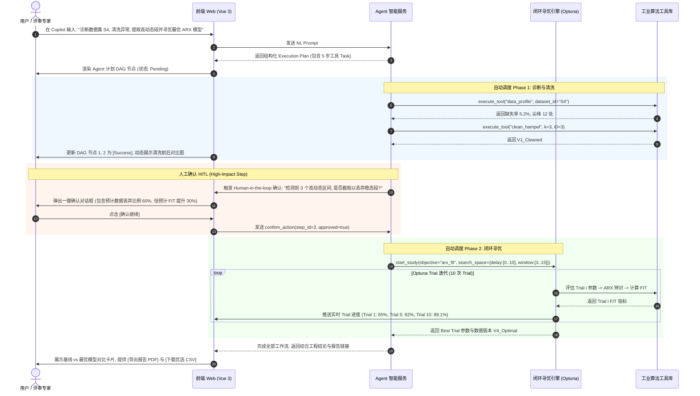

# IndusOpt 工模智优 - 前端端到端用户操作流程 (User Flows)

**文档版本**：`v0.1.0`  
**适用阶段**：阶段 0（需求与设计冻结）  
**责任角色**：Gemini (前端与可视化架构师)  

---

## 1. 核心流程总览

IndusOpt 支持三种典型的端到端操作路径：

```text
[路径 A: 交互式分步精细处理 (Manual Step-by-Step Flow)]
上传 CSV ──> 质量诊断 ──> 清洗/规整 ──> 动态区间筛选 ──> 时滞补偿 ──> 变量剔除 ──> ARX 辨识 ──> 报告导出

[路径 B: 仿真 Benchmark 校验流程 (Simulation Baseline Flow)]
生成 S3/S4 仿真数据 ──> 查看真值卡片 ──> 运行预设 Pipeline ──> 比对估计参数 vs 真值 ──> 验证算法精度

[路径 C: Agent 自然语言智能闭环流程 (NL Agent Automated Flow - 评委演示主推荐)]
自然语言需求 ──> Agent 结构化计划 ──> DAG 工具调度 ──> 人工高风险确认 ──> Optuna 自动迭代 ──> 最优产物
```

---

## 2. 流程 A：交互式分步处理流程 (Modeling Engineer Step-by-Step)

```mermaid
flowchart TD
    Start[1. 用户在 /datasets 拖拽上传 industrial_data.csv] --> Profile[2. 自动跳转质量诊断 Tab]
    Profile --> CheckProfile{质量问题判断}
    CheckProfile -- 存在缺失值/异常点/采样不均 -- FloatingClean[3. 点击'去清洗'进入 /preprocessing/cleaning]
    CheckProfile -- 数据质量良好 -- FloatingSeg[4. 直接进入 /preprocessing/segmentation]
    
    FloatingClean --> CleanSubmit[配置 Hampel / 重采样参数, 点击'执行清洗']
    CleanSubmit --> SaveV1[生成数据版本 V1_Cleaned, 展示前后对比]
    SaveV1 --> FloatingSeg
    
    FloatingSeg --> SegSubmit[设置 SNR 阈值与动态度, 执行动态区间识别]
    SegSubmit --> SaveV2[生成数据版本 V2_Segmented, 背景高亮高动态段]
    SaveV2 --> FloatingDelay[5. 进入 /preprocessing/delay]
    
    FloatingDelay --> DelayCalc[计算多变量 Lag Correlation 曲线]
    DelayCalc --> DelayApply[勾选建议的峰值滞后步数, 执行时滞补偿]
    DelayApply --> SaveV3[生成数据版本 V3_Delayed]
    SaveV3 --> FloatingColl[6. 进入 /preprocessing/collinearity]
    
    FloatingColl --> CollCalc[计算 Pearson 矩阵与 VIF 方差膨胀因子]
    CollCalc --> CollDrop[系统提示: U2 与 U1 强相关, 点击'剔除 U2']
    CollDrop --> SaveV4[生成数据版本 V4_Selected]
    SaveV4 --> FloatingARX[7. 进入 /modeling/arx]
    
    FloatingARX --> ARXFit[设置 na=2, nb=2, 运行最小二乘/岭回归]
    ARXFit --> DisplayFIT[显示验证集 R²=82.5%, FIT=76.3%, 残差 ACF 检验]
    DisplayFIT --> Export[8. 进入 /deliverables 导出报告与 V4 CSV]
```

---

## 3. 流程 B：仿真 Benchmark 校验流程 (Simulation & Validation)

1. **入口**：导航至 `/simulation`。
2. **配置仿真**：
   * 选择预设场景：`场景 S3 (长稳态 + 阶跃/斜坡短动态)` 或 `场景 S4 (缺失/冻结/噪声污染数据)`。
   * 设置采样点数 $N=5000$，噪声水平 $\sigma=0.1$。
   * 点击 `[生成仿真数据集]`。
3. **查看真值卡片 (Ground Truth)**：
   * 页面右侧弹出真值信息：真值方程 $A(q^{-1})y(t) = B(q^{-1})u(t-d) + e(t)$、真值滞后 $d_{true}=5$、真实动态段 $[200, 450], [1200, 1500]$。
4. **运行基线辨识**：
   * 点击 `[一键未处理直接辨识]`，记录基线 $R_{baseline}^2 = 45.2\%$（受长稳态与噪声严重拉低）。
5. **应用优化 Pipeline**：
   * 点击 `[应用标准优选 Pipeline]`，依次执行清洗、区间截取与时滞补偿。
6. **参数对齐验证**：
   * 系统对比输出：辨识出的滞后 $\hat{d}=5$（完全匹配），动态区间覆盖率 $96.8\%$，辨识 Fit 提升至 $88.6\%$。

---

## 4. 流程 C：Agent 自然语言智能闭环流程 (NL Agent Automation with HITL)

该流程为**竞赛演示与答辩最核心路径**，突出自然语言驱动与白名单工具调度的可信闭环。



---

## 5. 异常与回滚流程 (Error & Rollback Flow)

1. **算法执行失败**：
   * 例如在共线性剔除时，若用户强制保留全部高共线性变量导致 ARX 矩阵奇异发散。
   * **前端表现**：后端返回 `ERROR: SINGULAR_MATRIX (矩阵奇异，共线性过高)`。
   * **修复入口**：UI 弹出错误解释卡片，提供 `[一键回退到上一个稳定数据版本 V3]` 或 `[自动应用 Ridge 岭回归以稳定求解]` 的直接行动按钮。
2. **用户中途取消长任务**：
   * 在 Optuna 100 次 Trial 执行到第 20 次时，用户点击 `[停止寻优]`。
   * **前端表现**：立即止损，保留前 20 次 Trial 中的 Best Result，状态标记为 `[已中途取消 (Partial Best Saved)]`，允许导出当前阶段的成果。
